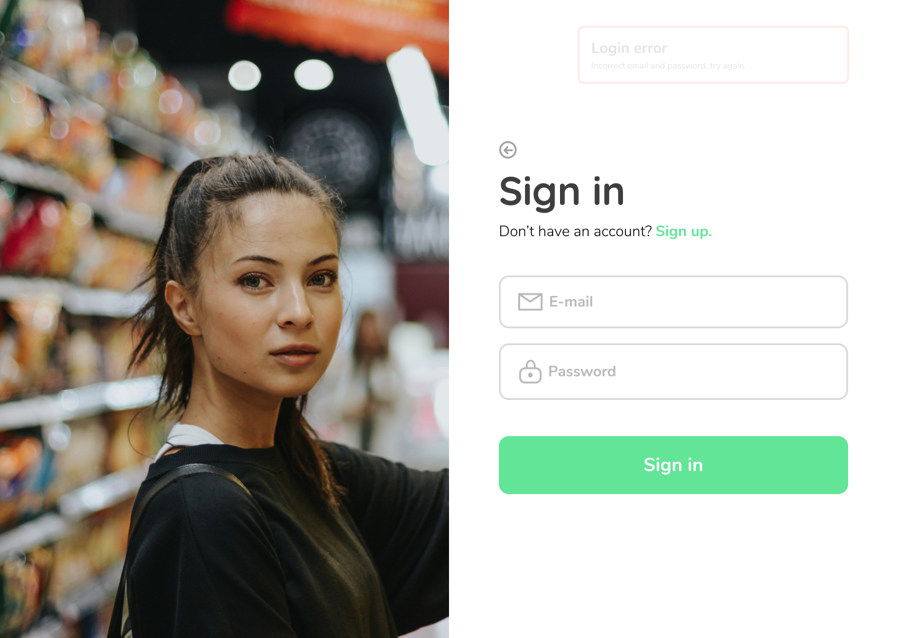
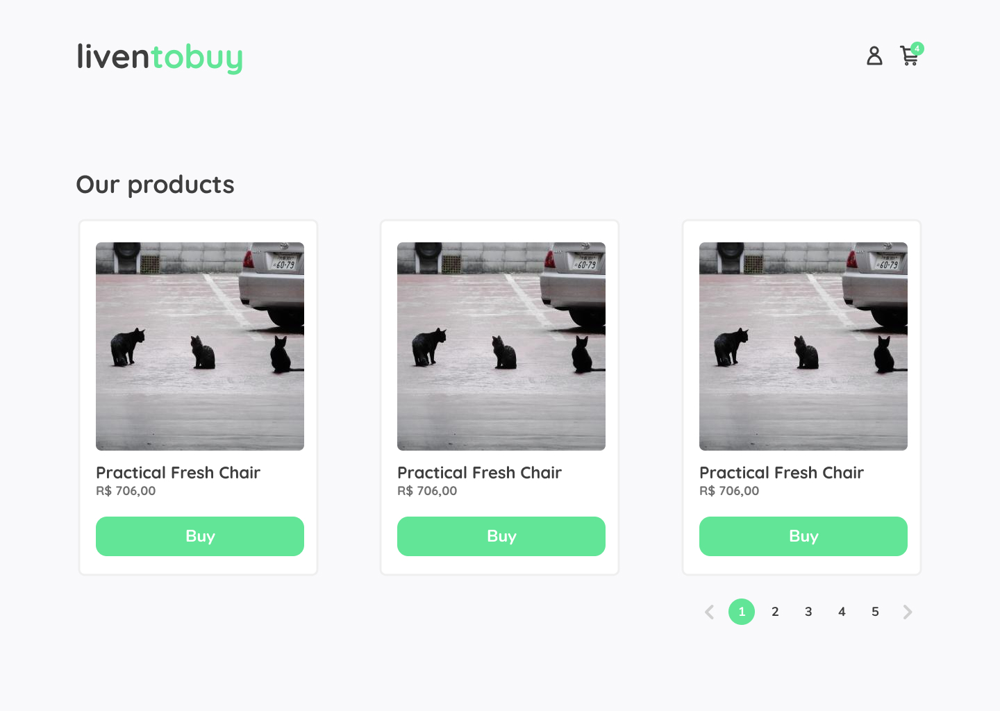
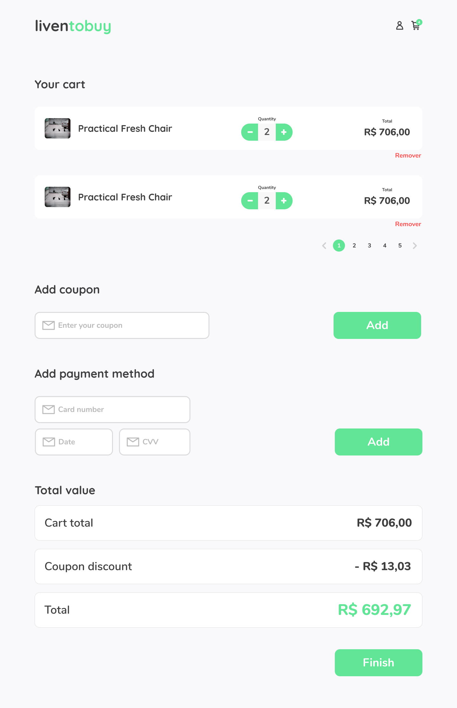

<style>
@import url('https://fonts.googleapis.com/css2?family=Nunito:wght@700&display=swap');
</style>

<!-- Logo -->

<p align="center">
  
<p>

<!-- Badges -->

<p align="center">
  
  
  

  
</p>

<!-- Description -->

<h3 align="center" style="font-family: Nunito; font-weight: bold">
	🚀 Liven's online store 💥
</h3>

<!-- Project Design -->

<p align="center">
  
  
<p>

<p align="center">
  
</p>

<!-- Summary -->

<h2>Summary</h2>

- [:bookmark: About](#bookmark-about)
- [:framed_picture: Layout](#framed_picture-layout)
- [:computer: Demo](#computer-demo)
- [:rocket: Tecnologias](#rocket-tecnologias)
- [:book: O que aprendi](#book-o-que-aprendi)
- [:sparkles: O que falta](#sparkles-o-que-falta)
- [:recycle: Como contribuir](#recycle-como-contribuir)
- [:memo: Licença](#memo-licença)

<a id="about"></a>

## :bookmark: About

**Liven to buy** is an application that simulates a virtual store, where it is possible to add fake products to a cart and make a fake purchase.

This application was developed during [@liven](https://liven.tech) training week.

<a id="layout"></a>

## :framed_picture: Layout

The layout of this application is available on [Figma](https://www.figma.com/file/nSrN4Ip6rh4h2Fhaan2Zsq/Liven-to-Buy?node-id=10%3A109).

<a id="demo"></a>

## :computer: Demo

This application was hosted by [Netlify](https://www.netlify.com/) and can be found here: [Liven to Buy](https://liventobuy.netlify.app/).

<a id="tecnologias"></a>

## :rocket: Tecnologias

Essa aplicação se utiliza das seguintes tecnologias:

- [TypeScript](https://www.typescriptlang.org/)
- [ReactJS](https://reactjs.org/)
- [ESLint](https://eslint.org/) (Padronização de código)
- [Prettier](https://prettier.io/) (Formatação de código)
- [Sass](https://sass-lang.com/) (Pré-processador CSS)
- [React Sound](https://github.com/leoasis/react-sound) (Reprodução de áudios)

<a id="o-que-aprendi"></a>

## :book: O que aprendi

- ### Memoização
  Para evitar redefinições dos callbacks a cada re-renderização do componente, foi utilizado o `useCallback` que retornará um callback memoizado, ou seja, mantém um valor salvo para otimizar performance.

Além disso, passando um array de dependências, pode-se redefinir os callbacks condicionalmente, isto é, caso um dos valores passados no arary mude o callback irá ser redefinido.

```tsx
const handleStart = useCallback(() => {
  startTimer({
    minute: workingTime,
    second: 0,
  })
}, [workingTime, startTimer])
```

Neste método, o `handleStart` só irá ser redefinido caso `workingTime` ou `startTimer` mudem de valor.

- ### Limpeza de efeitos
  Graças ao `useEffect`, é possível executar efeitos colaterais após cada renderização concluída do componente. No entanto, diversas vezes efeitos criam recursos que precisam ser desfeitos ou limpos antes que o componente deixe a tela, como fechar uma Stream ou limpar a memória utilizada por uma variável.

Para fazer isso, basta retornar uma função de limpeza no `useEffect`, onde esta irá ser executada **antes que o componente seja removido da interface**.

```tsx
useEffect(() => {
  let timeout: NodeJS.Timeout

  if (timerState === TimerState.IN_PROGRESS) {
    timeout = setTimeout(handleTime, INTERVAL_TIME)
  }

  return () => clearTimeout(timeout)
}, [time, timerState])
```

O código acima é um efeito que cria um timeout a cada segundo para modificar o tempo do cronômetro. Caso `time` ou `timerState` mudem, o efeito irá ser executado novamente, porém antes disso o `clearTimeout(timeout)` é executado na função de limpeza para remover o timeout anterior.

Dessa forma não há o risco de haver timeouts duplicados.

- ### Referência de elementos
  Com o `useRef`, foi possível capturar a referência de elementos HTML.

```tsx
const alertRef = useRef<HTMLDivElement>(null)
//...
return (
  <div className="alert-container" ref={alertRef}>
    {/* ... */}
  </div>
)
```

Dessa forma, pode-se acessar o DOM deste elemento usando `alertRef.current`.

```tsx
function animateShowAlert() {
  if (!alertRef) return
  if (!alertRef.current) return

  alertRef.current.classList.add('active-alert')
}
```

<a id="o-que-falta"></a>

## :sparkles: O que falta

- [x] Reproduzir som a cada fim de sessão
- [x] Componente para visualizar alertas
- [ ] Componente para barra de progresso circular
- [ ] Componente para campo de entrada do tipo Slider

<a id="como-contribuir"></a>

## :recycle: Como contribuir

- Crie um fork desse repositório,
- Crie uma branch com o nome da sua feature: `git checkout -b my-feature`
- Faça um commit das suas alterações: `git commit -m 'feat: My new feature'`
- Faça um push da sua branch: `git push origin my-feature`

<a id="licenca"></a>

## :memo: Licença

Esse projeto está sob a licença MIT. Veja o arquivo [LICENSE](LICENSE) para mais detalhes.

---

<p align="center">
  Feito com ❤️ por <a href="https://github.com/igooralm192" target="_blank">Igor Almeida</a>!!
</p>
